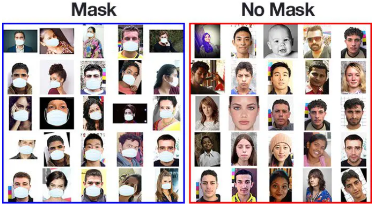

# Detect Face Mask (CNN, Convolutional neural network)

In the deep learning, using a convolutional neural network (**CNN**) we are trying to detect which faces wear **MASK** and which no.

## COVID-19 face mask detection dataset



> A face mask detection dataset consists of “with mask” and “without mask” images. We will use the dataset to build a COVID-19 face mask detector with computer vision and deep learning using Python, OpenCV, and TensorFlow/Keras.


This dataset consists of 1,376 images belonging to two classes:
- **with_mask:** 690 images
- **without_mask:** 686 images

Our goal is to train a custom deep learning model to detect whether a person is or is not wearing a mask.

**Note:** For convenience, I have included the dataset created by Prajna.

## Using

```
$ python preprocessing.py
$ python train.py
$ python demo.py
```

### Figure loss and accuracy


## Sources

I am not owner of most of things and I just used a dataset which avaiable on the following links. It was so funny for me to implenment and test and running this idea (Detect Masky face) in my machine.

- https://pyimagesearch.com/2020/05/04/covid-19-face-mask-detector-with-opencv-keras-tensorflow-and-deep-learning/
- https://pythonprogramming.net/convolutional-neural-network-deep-learning-python-tensorflow-keras/
- https://github.com/prajnasb/observations/tree/master/experiements/data
- https://drive.google.com/drive/folders/1WCxe1EuxLo6qyGVpupcEMTgN83xpgHM_
- https://www.youtube.com/watch?v=iwv0iU9AxbE
- https://www.youtube.com/watch?v=d3DJqucOq4g

Thank you from all and specially from keras, sklearn developers.
